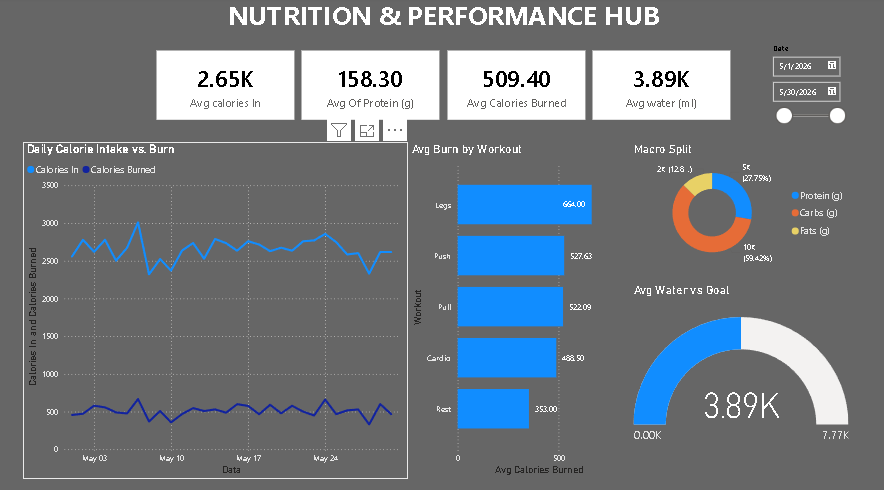

# 🏋️‍♂️ Nutrition & Performance Hub - Power BI Analytics

## 📌 Project Overview
This project is an end-to-end data analytics dashboard designed to track, visualize, and analyze 30 days of personal fitness and nutrition data. The goal of this project is to uncover actionable insights regarding daily macronutrient intake, caloric burn rates across different training sessions, and overall fitness progression.

## 📊 Dashboard Preview

## Tech Stack & Skills Demonstrated
* **Data Visualization:** Power BI
* **Data Processing & Transformation:** Power Query, Data Modeling
* **Calculations:** DAX (Data Analysis Expressions)
* **Data Source:** Raw data extraction

## Key Features & Insights
* **Performance KPIs:** Dynamic top-level cards calculating average protein intake, water consumption, and total calories consumed vs. burned.
* **Daily Calorie Intake vs. Burn:** A time-series analysis showing the daily variance and energy expenditure trends over a 30-day tracking period.
* **Average Burn by Workout:** A clustered bar chart identifying which training modalities (e.g., Leg Day, Push, Pull, Cardio) yield the highest average caloric output.
* **Macro Split Analysis:** A dynamic donut chart breaking down the exact dietary distribution of Protein, Carbohydrates, and Fats.
* **Goal Tracking:** A gauge chart tracking daily water intake against predefined performance targets.

## How to View the Project
1. View the **[Dashboard Preview](dashboard_screenshot.png.png)** or the **[PDF export](NUTRITION%20&%20PERFORMANCE%20HUB.pdf)** for a quick static look at the dashboard.
2. To interact with the data and filters, download the **`NUTRITION & PERFORMANCE HUB.pbix`** file and open it in Power BI Desktop.
3. The raw extracted dataset used to build this dashboard is available in the **`fitness_data.csv.xlsx`** file.
